# periodic-function

Periodic waveform functions. Phase `t` is normalized to `[0, 1]` — one full turn.

```
npm install periodic-function
```

```js
import { sine, square, wavetable } from 'periodic-function'

sine(0.25)          // 1  (peak)
square(0.75)        // -1 (low)
wavetable(null, [0, 1, 0, 0.5])  // Float32Array wavetable from Fourier coefficients
```

## API

All functions take phase `t ∈ [0, 1]` as first argument. Values outside `[0, 1]` wrap correctly.

| | Function | Description |
|:---:|---|---|
| | **Waveforms** | |
| 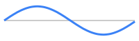 | `sine(t, phase=0)` | Sine wave. `phase=0.25` gives cosine. |
| 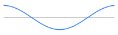 | `cosine(t, phase=0)` | Cosine wave. Equivalent to `sine(t, 0.25)`. |
| 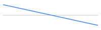 | `sawtooth(t)` | Descending ramp: 1 at t=0, −1 approaching t=1. For ascending ramp use `triangle(t, 0)`. |
| 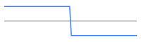 | `square(t, duty=0.5)` | Square wave. `duty` = fraction of period spent high. |
| 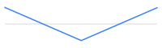 | `triangle(t, ratio=0.5)` | Triangle wave. `ratio` = peak position (0 = ascending ramp, 1 = descending ramp). |
| 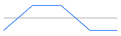 | `trapezoid(t, p1=0.25, p2=0.5, p3=0.75)` | Trapezoid wave. Rise ends at `p1`, fall starts at `p2`, fall ends at `p3`. Generalizes square and triangle. |
| 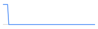 | `pulse(t, width=0)` | Dirac-like pulse: 1 at t=0, 0 elsewhere. `width` extends the high region. |
| 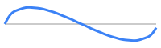 | `clausen(t, harmonics=10)` | [Clausen function](https://en.wikipedia.org/wiki/Clausen_function): Σ sin(kθ)/k². |
| 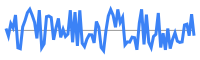 | `noise(t)` | Periodic noise — repeating random buffer. |
| | **Fourier / Wavetable** | |
| 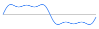 | `fourier(t, real, imag)` | Evaluate one sample from Fourier coefficients. `real[k]` and `imag[k]` are cosine/sine amplitudes for harmonic `k`. Index 0 is DC, 1 is fundamental. |
| 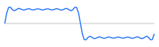 | `wavetable(real, imag, {size=8192, normalize=true})` | Build a `Float32Array` wavetable from Fourier coefficients. Used for `AudioContext.createPeriodicWave`. |
| | **Lookup** | |
| 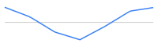 | `interpolate(t, samples)` | Linearly interpolate between samples, treating them as one period. |
| 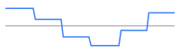 | `step(t, samples)` | Step lookup — nearest sample, no interpolation. |

## Examples

```js
// Cosine as a phase-shifted sine
sine(0, 0.25)     // 1  (same as cosine(0))

// Square wave with 10% duty cycle
square(0.05, 0.1) // 1
square(0.15, 0.1) // -1

// Triangle with peak at 0.25 (asymmetric)
triangle(0.25, 0.25) // -1  (valley, since peak is at t=0)

// Trapezoid as a square with soft edges
trapezoid(t, 0.05, 0.5, 0.55)

// Fourier series: pure sine
fourier(0.25, null, [0, 1])  // 1

// Wavetable for Web Audio API PeriodicWave
const real = new Float32Array(64)
const imag = new Float32Array(64)
for (let k = 1; k < 64; k += 2) imag[k] = 4 / (Math.PI * k)  // square wave
const table = wavetable(real, imag)  // Float32Array[8192], normalized to ±1
```

## Related

- [web-audio-api](https://github.com/audiojs/web-audio-api) — uses `wavetable()` for `PeriodicWave`
- [MDN: createPeriodicWave](https://developer.mozilla.org/en-US/docs/Web/API/AudioContext/createPeriodicWave)
- [List of periodic functions](https://en.wikipedia.org/wiki/List_of_periodic_functions)

## License

MIT © Dmitry Iv

<p align=center><a href="https://github.com/krishnized/license/">ॐ</a></p>
